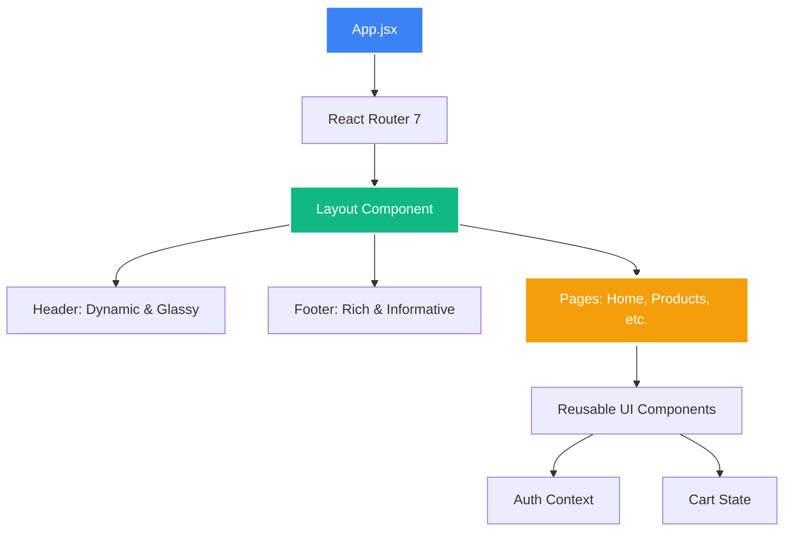

# 🚀 TechZone - Premium Tech Store

https://tech-3.netlify.app/ <-----SAYTNI TOLIGINI KORISH

[](https://reactjs.org/)
[](https://vitejs.dev/)
[](https://tailwindcss.com/)
[](https://www.framer.com/motion/)

Welcome to the **TechZone React Migration** project. This is a high-performance, modern e-commerce platform built for speed, aesthetics, and a premium user experience.

---

## ✨ Features

- 🏎️ **Lightning Fast**: Built with Vite for instant server start and HMR.
- 📱 **Fully Responsive**: Optimized for all devices from mobile to 4K displays.
- 🎨 **Premium UI**: Modern design with glassmorphism, smooth gradients, and micro-animations.
- 🛒 **Advanced Shopping**: Dynamic cart, wishlist, and product comparison features.
- 🌗 **Dark/Light Mode**: Seamless theme switching with system preference detection.
- 🔍 **Smart Search**: Real-time product filtering and search capabilities.

---

## 🛠️ Tech Stack

- **Framework**: [React 19](https://react.dev/)
- **Bundler**: [Vite](https://vitejs.dev/)
- **Styling**: [Tailwind CSS](https://tailwindcss.com/)
- **Routing**: [React Router 7](https://reactrouter.com/)
- **Animations**: [Framer Motion](https://www.framer.com/motion/)
- **Icons**: [Lucide React](https://lucide.dev/)

---

## 📂 Project Architecture

The project follows a modular, feature-based architecture to ensure scalability. For a detailed breakdown, see [ARCHITECTURE.md](./ARCHITECTURE.md).

```bash
src/
├── components/   # Reusable UI building blocks
├── contexts/     # Global state management
├── hooks/        # Custom logic and data fetching
├── pages/        # Main application views
└── assets/       # Styles and media
```

---

## 🚀 Getting Started

### 1. Clone & Install
```bash
git clone <repository-url>
cd techzone-react
npm install
```

### 2. Development
```bash
npm run dev
```

### 3. Build for Production
```bash
npm run build
```

---

## 📈 Roadmap

- [x] Project Initialization
- [x] Architecture Setup
- [ ] Asset Migration
- [ ] Header & Footer Components
- [ ] Homepage Migration
- [ ] Product Detail Pages
- [ ] Cart & Checkout Flow
- [ ] Global Search Integration

---

## 🤝 Contributing

Contributions are welcome! Please feel free to submit a Pull Request.

---

<div align="center">
  <p>Made with ❤️ by the TechZone Team</p>
</div>

# 🚀 TechZone: The React Evolution
### From Static to Stellar: A Premium Migration Journey

---

## 💎 The Vision
Transforming a traditional electronics store into a **state-of-the-art digital experience**. TechZone isn't just a shop; it's a destination for tech enthusiasts.

> [!IMPORTANT]
> **Goal**: 100% React Migration, 0% compromise on aesthetics.

---

## 🛠️ The Tech Core
We chose only the best-in-class tools for this transformation:

| Technology | Role | Benefit |
| :--- | :--- | :--- |
| **React 19** | Core UI | Unmatched performance and state management |
| **Vite** | Bundler | Instant HMR and lightning-fast builds |
| **Tailwind CSS 4.0** | Styling | Utility-first precision with a premium feel |
| **Framer Motion** | Animations | Smooth, organic interactions that feel "alive" |
| **Lucide React** | Icons | Crisp, modern, and high-quality iconography |

---

## 🏗️ Premium Architecture
We didn't just move files; we rebuilt the foundation.



---

## ✨ Visual Highlights

````carousel
```text
[ MODERN HEADER ]
- Sticky glassmorphism effect
- Real-time search integration
- Smooth theme toggle (Dark/Light)
- Multi-language support (UZ/RU/EN)
```
<!-- slide -->
```text
[ HERO SECTION ]
- High-impact visual hierarchy
- Floating 3D-effect UI elements
- Framer Motion entry animations
- Gradient text and premium buttons
```
<!-- slide -->
```text
[ PRODUCT CARDS ]
- Interactive hover states
- Premium card-within-card shadow
- Glassmorphism action badges
- Responsive grid layout
```
````

---

## 🌗 Dark Mode Perfection
Seamlessly switching between light and dark themes with system preference detection.

> [!TIP]
> Try it now in the top right corner! The transitions are buttery smooth.

---

## 📈 The Roadmap Ahead
Our journey doesn't end here:

- [x] **Phase 1**: Architecture & Core Homepage
- [/] **Phase 2**: Product Listings & Advanced Filters
- [ ] **Phase 3**: Cart & Checkout Synchronization
- [ ] **Phase 4**: User Authentication & Profiles
- [ ] **Phase 5**: SEO & Performance Optimization

---

## 🏁 Final Words
TechZone is now faster, more beautiful, and ready for the future.

**Let's keep building!** 🚀

---
<div align="center">
  <p>Created with ❤️ by Davlat</p>
</div>


TechZone React Migration Walkthrough
I have successfully migrated the core of the TechZone static website to a modern, high-performance React application.

Key Accomplishments
Premium Architecture: Implemented a scalable folder structure following industry best practices.
Stunning UI/UX: Used Tailwind CSS 4.0 and Framer Motion to create a premium, interactive experience.
Asset Migration: Successfully moved all product and brand images to the React project.
Componentized Design: Created reusable components for Header, Footer, Layout, and Product Cards.
Responsive Homepage: Ported the entire homepage with dynamic sections for offers, bestsellers, and features.
Dark Mode Support: Built-in support for theme switching with smooth transitions.
Changes Made
Documentation & Architecture
[NEW] 
README.md
[NEW] 
ARCHITECTURE.md
Layout Components
[NEW] 
Header.jsx
[NEW] 
Footer.jsx
[NEW] 
Layout.jsx
[NEW] 
Hero.jsx
Product Components
[NEW] 
ProductCard.jsx
Pages
[NEW] 
Home.jsx
Verification Results
Automated Build
The project builds successfully without errors.

npm run build

